# Color Conversion
## AIM
To perform the color conversion between RGB, BGR, HSV, and YCbCr color models.

## Software Required:
Anaconda - Python 3.7
## Algorithm:
### Step1:
Import cv2 and save an image as scolor.jpeg.

### Step2:
Use imread to read and display the image.

### Step3:
Use cv2.cvtColor(src, code, dst, dstCn) to convert an image from one color space to another.

### Step4:
Split and merge the image using cv2.split and cv2.merge commands.

### Step5:
End the program and view the output image windows.

## Program:
```python
# Developed By:Anusha R
# Register Number:212221230006
# READ AND DISPLAY THE IMAGE
import cv2
scolor=cv2.imread('aa.jpeg')
cv2.imshow('Original Image',scolor)
cv2.waitKey(0)
cv2.destroyAllWindows()
# i) Convert BGR and RGB to HSV and GRAY
#BGR2HSV
hsvimg=cv2.cvtColor(scolor,cv2.COLOR_BGR2HSV)
cv2.imshow('BGR2HSV',hsvimg)
cv2.waitKey(0)
cv2.destroyAllWindows()

#BGR2GRAY
grayimg=cv2.cvtColor(scolor,cv2.COLOR_BGR2GRAY)
cv2.imshow('BGR2GRAY',grayimg)
cv2.waitKey(0)
cv2.destroyAllWindows()

#RGB2HSV
hsvimg2=cv2.cvtColor(scolor,cv2.COLOR_RGB2HSV)
cv2.imshow('RGB2HSV',hsvimg2)
cv2.waitKey(0)
cv2.destroyAllWindows()

#RGB2GRAY
grayimg2=cv2.cvtColor(scolor,cv2.COLOR_RGB2GRAY)
cv2.imshow('RGB2GRAY',grayimg2)
cv2.waitKey(0)
cv2.destroyAllWindows()


# ii)Convert HSV to RGB and BGR
#HSV TO RGB
rgbimg=cv2.cvtColor(scolor,cv2.COLOR_HSV2RGB)
cv2.imshow('HSV2RGB',rgbimg)
cv2.waitKey(0)
cv2.destroyAllWindows()

#HSV TO BGR
bgrimg=cv2.cvtColor(scolor,cv2.COLOR_HSV2BGR)
cv2.imshow('HSV2BGR',bgrimg)
cv2.waitKey(0)
cv2.destroyAllWindows()


# iii)Convert RGB and BGR to YCrCb
#BGR TO YCrCb
ybgr=cv2.cvtColor(scolor,cv2.COLOR_BGR2YCrCb)
cv2.imshow('BGR2YCrCb',ybgr)
cv2.waitKey(0)
cv2.destroyAllWindows()

#RGB TO YCrCb
yrgb=cv2.cvtColor(scolor,cv2.COLOR_RGB2YCrCb)
cv2.imshow('RGB2YCrCb',yrgb)
cv2.waitKey(0)
cv2.destroyAllWindows()


# iv)Split and Merge RGB Image
# SPLIT AND MERGE RGB IMAGE

blue=scolor[:,:,0]
green=scolor[:,:,1]
red=scolor[:,:,2]
cv2.imshow('B-Channel',blue)
cv2.imshow('G-Channel',green)
cv2.imshow('R-Channel',red)
merged_BGR=cv2.merge((blue,green,red))
cv2.imshow('Merged BGR Image',merged_BGR)
cv2.waitKey(0)
cv2.destoryAllWindows()


# v) Split and merge HSV Image
# SPLIT AND MERGE HSV IMAGE
hsv = cv2.cvtColor(scolor, cv2.COLOR_BGR2HSV)
h,s,v=cv2.split(hsv)
cv2.imshow("Hue-image",h)
cv2.imshow("Saturation-image",s)
cv2.imshow("Gray-image",v)
Merged_HSV=cv2.merge((h,s,v))
cv2.imshow('Merged HSV Image',Merged_HSV)
cv2.waitKey(0)
cv2.destoryAllWindows()


```
## Output:
### Original image
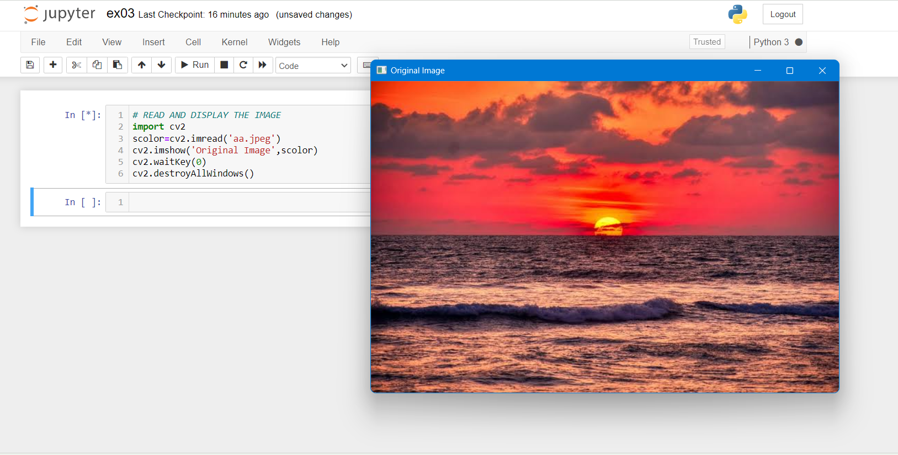
### i) BGR and RGB to HSV and GRAY
i) BGR TO HSV
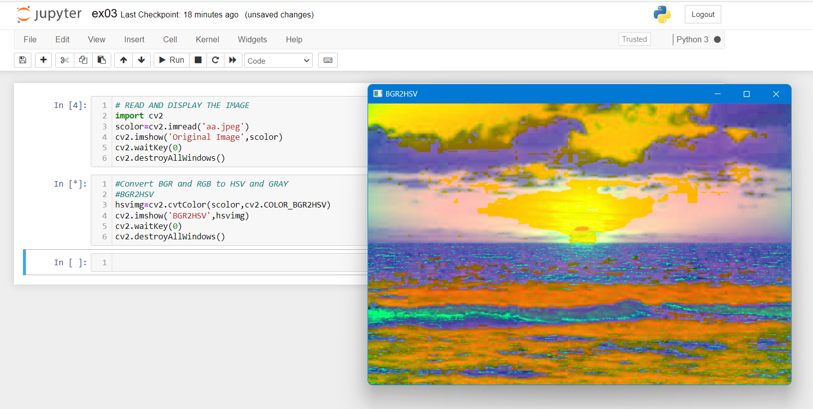
ii) BGR TO GRAY
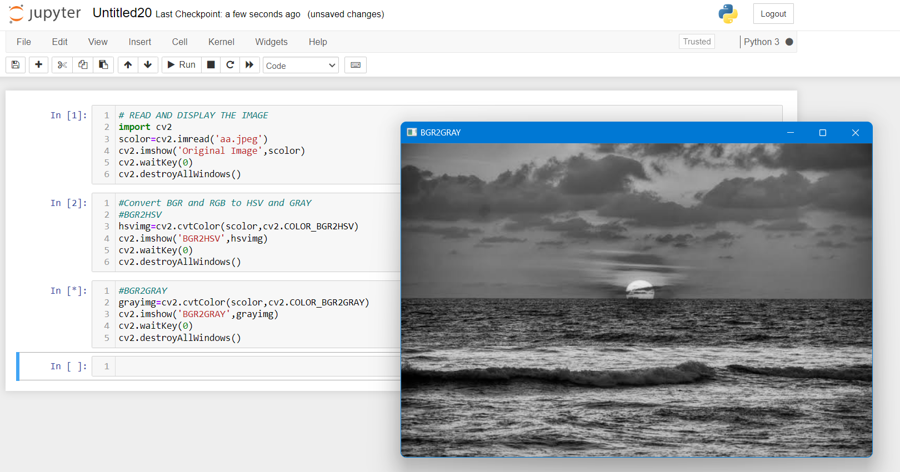
iii) RGB TO HSV
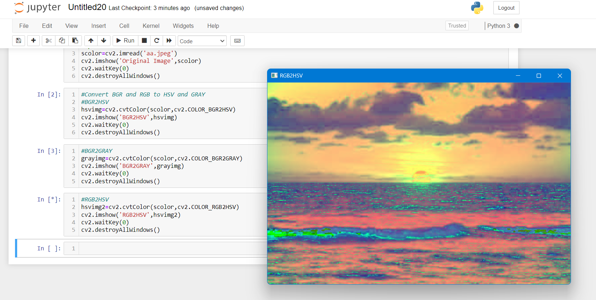
 iv)RGB TO GRAY
 


### ii) HSV to RGB and BGR
i) HSV TO RGB
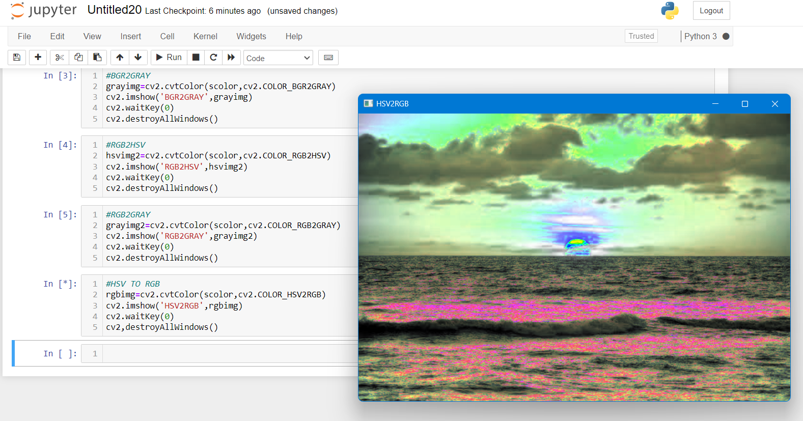
ii) HSV TO BGR
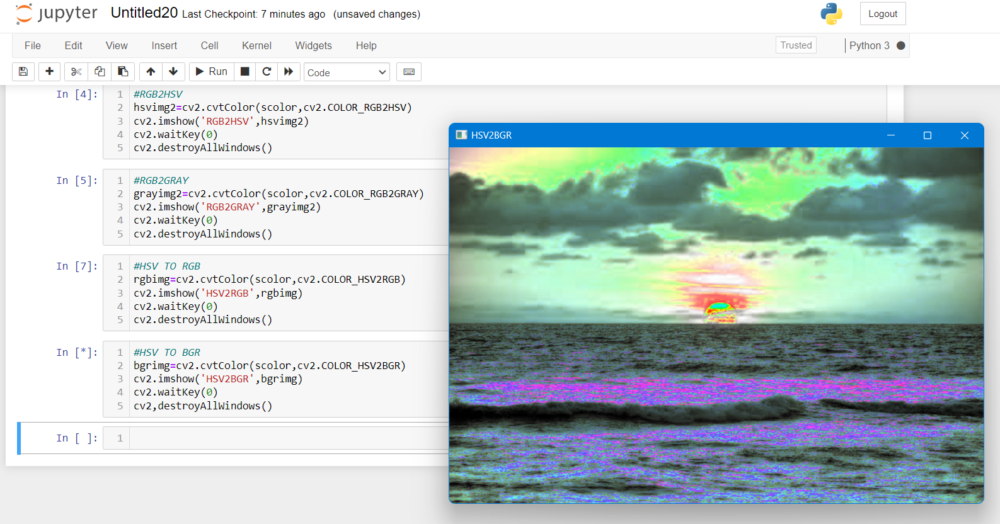

### iii) RGB and BGR to YCrCb
i) RGB TO YCrCb
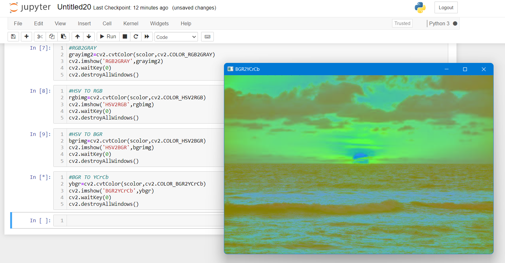
ii) BGR TO YCrCB
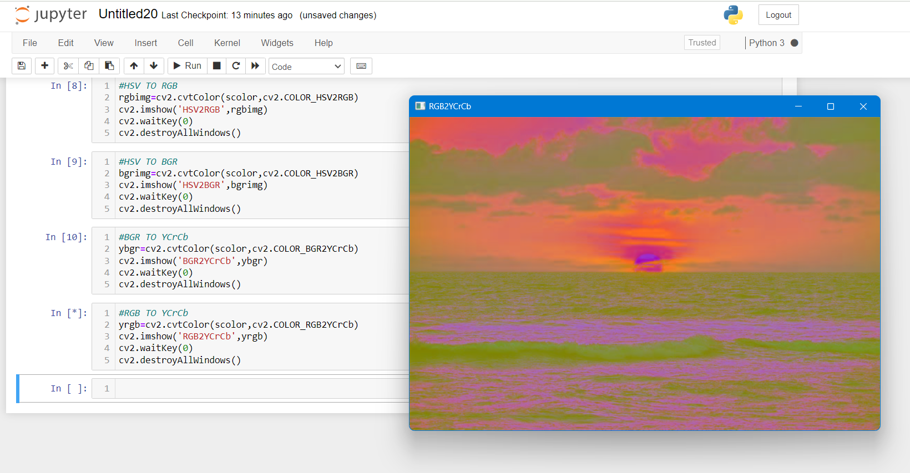

### iv) Split and merge RGB Image
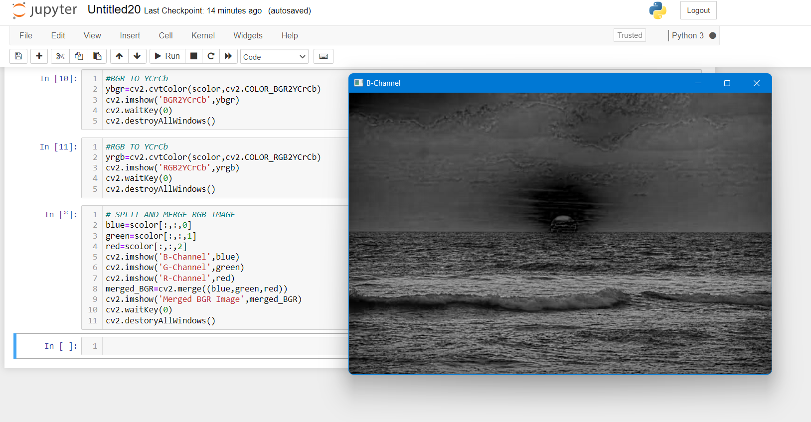
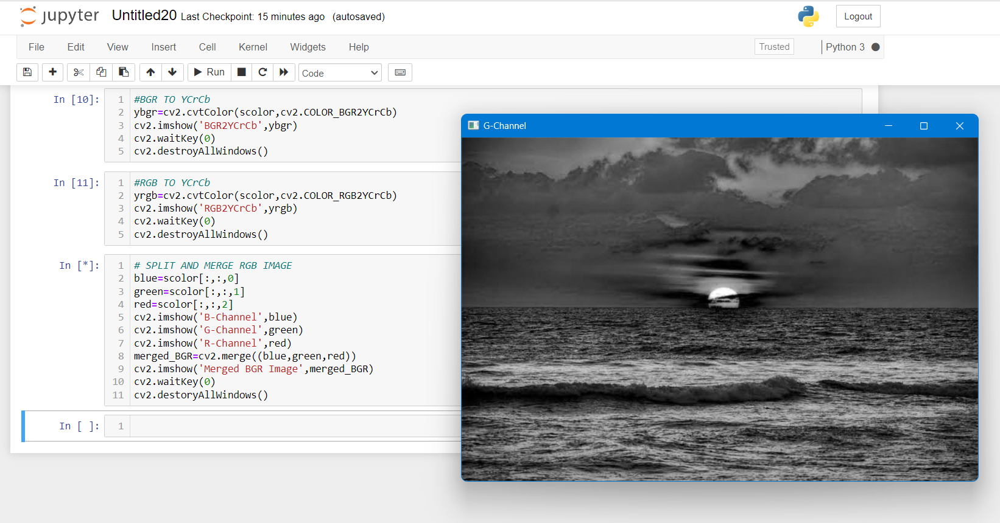
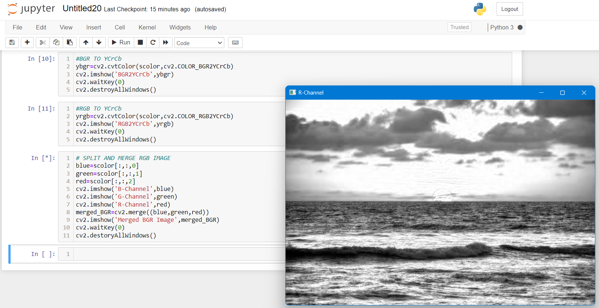
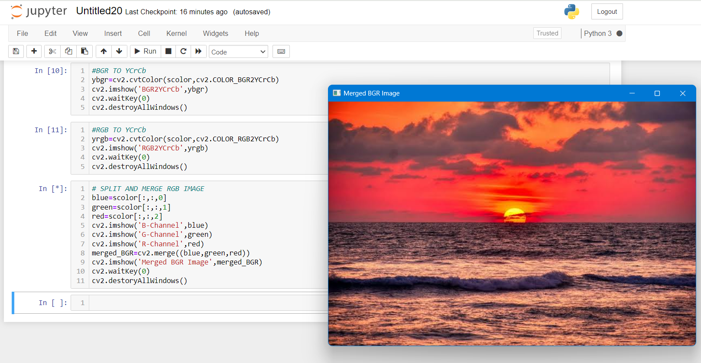
### v) Split and merge HSV Image
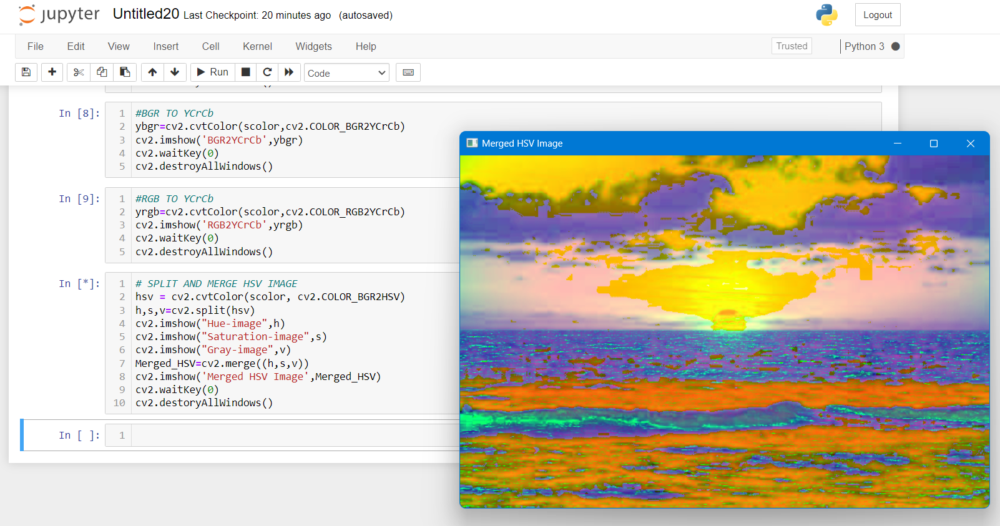
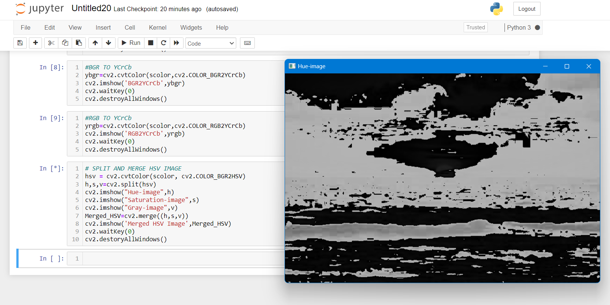
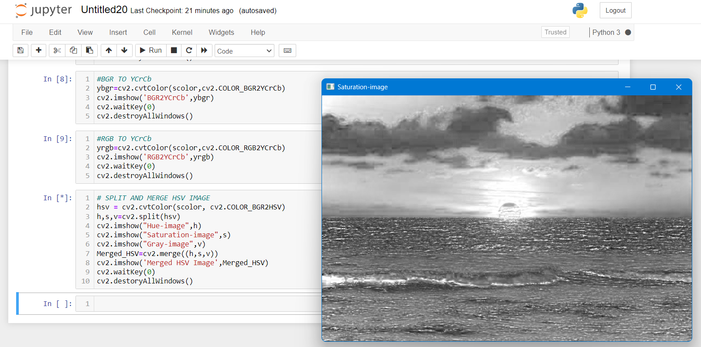
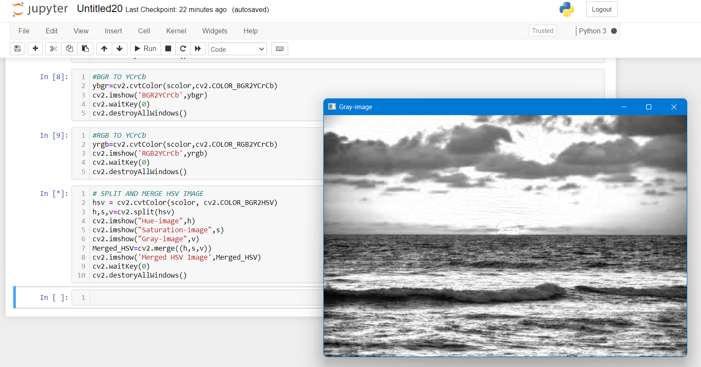
## Result:
Thus the color conversion was performed between RGB, HSV and YCbCr color models.
